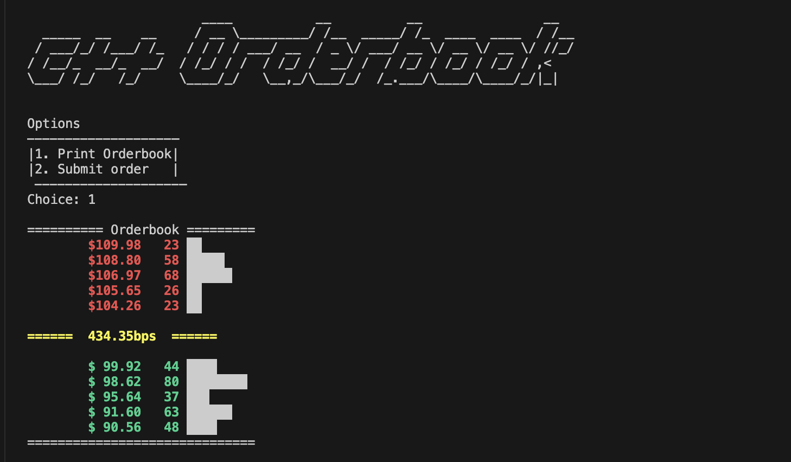
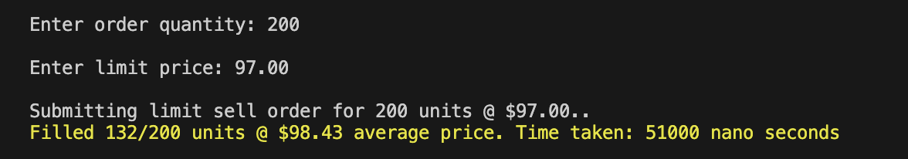
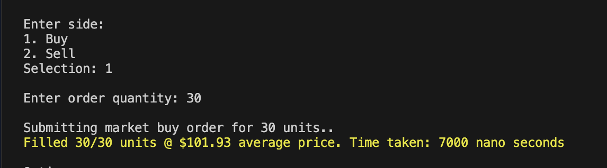
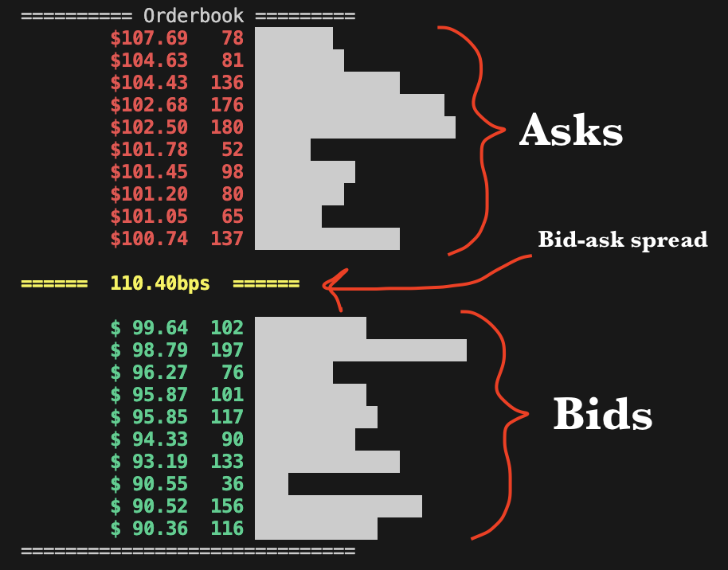

# Orderbook in C++

This project simulates a simple order book, an essential component in trading systems. It manages buy and sell orders using a FIFO order matching algorithm, supports both market and limit orders, handles partial and complete fills, and provides a visual representation of the order book's state.

***
## Features

* FIFO queue matching algorithm
* Visualization as seen above
* Accepts Market & Limit orders
* Whole and partial fills
* Pre-populates the orderbook with random orders

## Design

The project is designed using Object-Oriented Programming principles. It is divided into three main parts:

- `main.cpp`: This is where user interaction is handled. Users can place market or limit orders and the program will process them accordingly.
- `order.cpp`: This file contains the `Order` class, which represents an order. Each order has properties like price, quantity, and type (market or limit).
- `orderbook.cpp`: This file contains the `Orderbook` class, which manages order objects. It uses a FIFO queue to ensure that orders are processed in the order they are received. It also has logic to execute incoming orders against the book. And finally it has logic to visualize the book.

***

## How to Run

To compile and run the program, follow these steps:

1. Clone the repo at: ``https://github.com/ZT-19/simple-orderbook``
2. ``cd cpp-orderbook``
3. Compile the program using the command `g++ -std=c++14 ./src/main.cpp ./src/order.cpp ./src/orderbook.cpp -o main`.
4. Run the program `./main`.

***

## Screenshots

Screenshots of the project:

This limit order was partially filled, then rest (68 units) went on the book.

This market order was fully filled.

This is the order book visualized. 
***